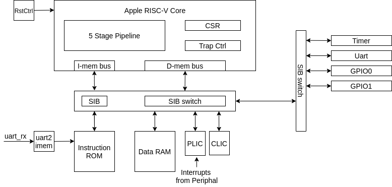

# Apple RISCV

- [Apple RISCV](#apple-riscv)
  - [Introduction](#introduction)
  - [Repo Structure](#repo-structure)
  - [Required Environment](#required-environment)
  - [Architecture](#architecture)

## Introduction

Apple RISCV is a simple RISC-V CPU supporting RV32I instruction set. (more instruction maybe added in future)

It has the following features:

### Hardware Feature

- Supporting RV32I ISA, and other necessary extensions ('Zicsr', mret, ecall, *ebreak*)
- Classic 5 stage pipeline design
- Support 4 interrupts (external, timer, software, *debug*) defined in RISC-V Specification
- A complete soc design capable of running basic embedded task.
- The HDL code is written in SpinalHDL.

### Software Feature

- Support C programming language compiled to newlib c library
- More features TBD (such as running embedded OS)

## Repo Structure

Here is the structures for apple riscv repo

```text
├── doc                 # Documents
├── fpga                # FPGA related build scripts
├── project             # SBT env related folder
├── src                 # spinalhdl scala HDL source files
└── tests               # Test related files
```

## Required Environment

To run the build/tests in the repo, the following environment are required

1. Scala and SBT
2. Python3
3. Cocotb
4. Icarus Verilog
5. Xilinx Vivado/Intel Quartus

## Architecture

Here is a brief introduction of the design micro-architecture. For more details, check the documents for [micro-architecture](doc/micro_arch.md)

### Apple RISC-V SOC

The apple riscv soc contains necessary peripherals for the cpu core to run basic task and embedded software.



### Apple RISC-V SOC

The RISC-V cpu core is designed as classic 5 stage pipeline. Here are the main modules in the 5 stage pipeline

- IF: containing pc register and instruction ram controller
- ID: containing instruction decoder unit
- EX: containing ALU(arithmetic logic unit), branch control unit, and forwarding unit.
- MEM: containing data memory controller
- WB: containing csr (control and status) module, trap (exception and interrupt) controller.

